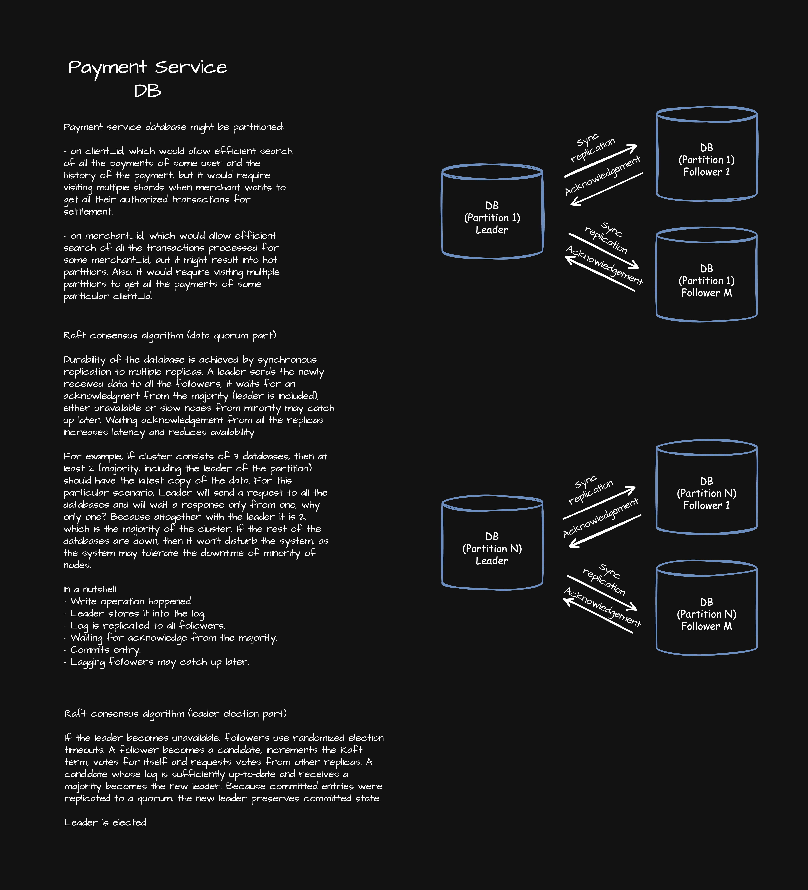

# banking-systems-lab
A distributed banking-system laboratory focused on ledger correctness, transactional workflows, observability, resilience, and performance under load.

## Context

### Payment Processing

Each payment has its own lifecycle. In order to complete, a payment gets through multiple
layers, namely through the following ones:
- Point-of-sale (POS).
- Payment Gateway.
- Payment Processor.
- Acquiring Bank.
- Card Network.
- Issuing Bank.

### Payment Settlement
Once per some time interval, a merchant run settlement operation, which sends all the gathered
authorized transactions and send them for settlement at merchant's bank account.

### Payment Gateway
Payment gateway is a bridge between point-of-sale (POS) and payment processors. Some systems
might serve as payment gateway and processor the same time. But let's separate these two
concepts for clarity.

Let's first take a look at sequence diagram for each payment that gets through payment gateway:

High level architecture is present below:

Database cluster setup, ensuring strict consistency and durability, is present below:
